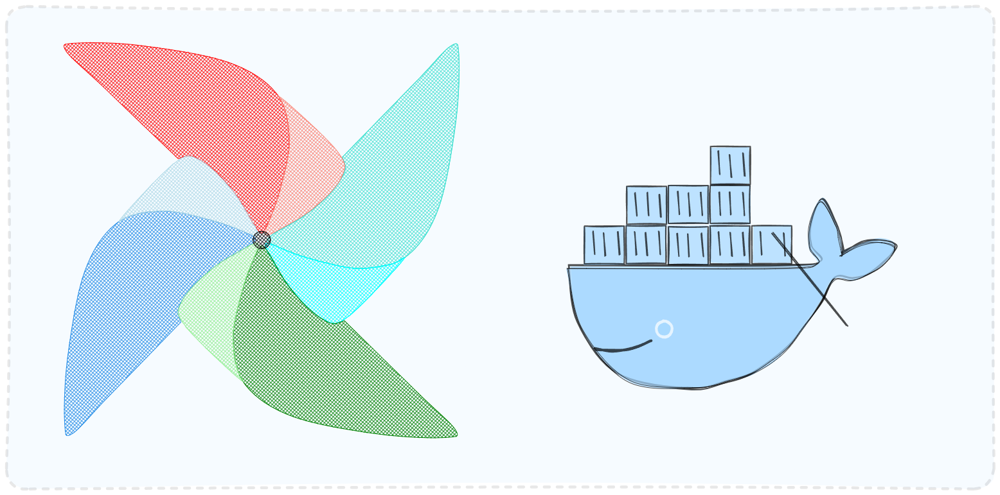

# Home

Documentation Airflow-Docker Studies

## Table of Contents

* `Intro` - What is Airflow? ✅🔨
* `v0` - First steps and examples. ✅
* `v1` - v0 spotify etl example with Medalion Architeture simulation. ✅
* `v2` - v1 + also persisting the data on a db. ✅
* `v3` - v2 + other datasources (webscraping, api, etc). 💡
* `v4` - v3 + creating a new operator 💡
* `v5` - Workings with alerts and logging. 💡
* `v6` - Docker Operator (Spark?).💡
* `v7` - DBT 💡
* `v8` - AIRBYTE 💡
* `v9` - K8 💡

#### Link for the repo: https://github.com/Gabriel-Philot/airflow_studies