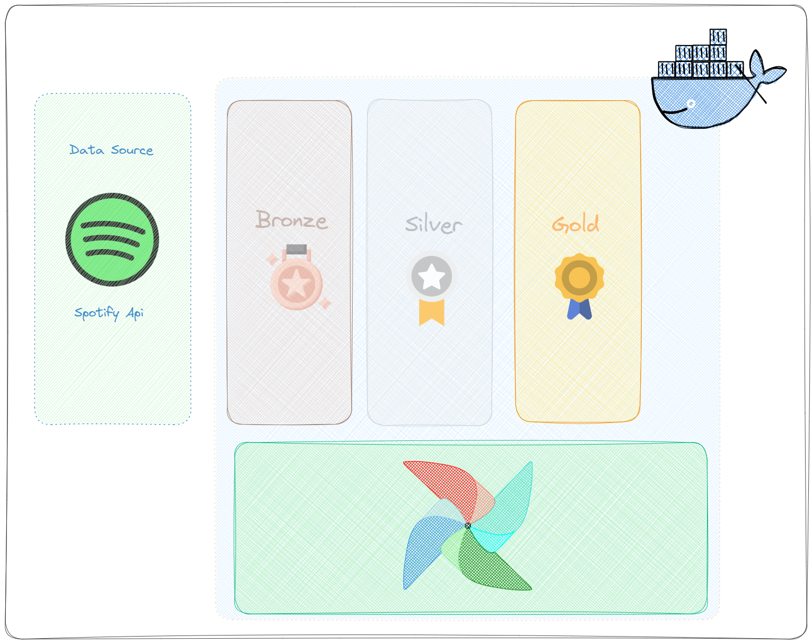
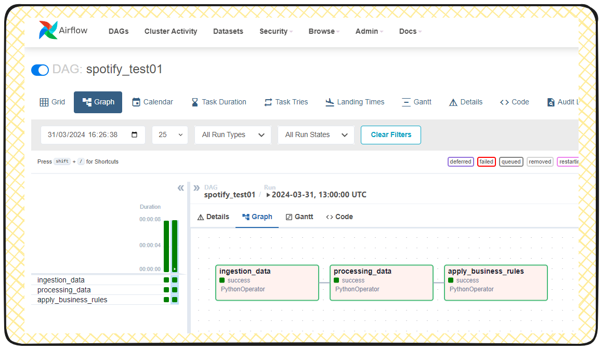

# v1


Ref:

#### [__Local data airflow ref__  ](https://www.linkedin.com/pulse/como-fazer-tratamento-de-dados-com-airflow-docker-salvando-souza/)
#### [__What is a Medallion Architecture? (Databricks)__  ](https://www.databricks.com/glossary/medallion-architecture)

## Simulating a "Medallion" architecture with ETL orchestrated by Airflow



> ❗WARNING: Airflow isnt design to be a process data tool 🔧, but to orchestrat the diferent tools to process data and manage the process. But in this exemple and sometimes it can do it with small amounts of data.

> ❗WARNING: The term "simulation of Medallion architecture" is used because the data will be stored outside of a data lake (locally). I chose to begin with this step for the sake of a simpler and 💰 cost-free 💰 example.

*I'm continuing to utilize my own functions and restricting the use to PythonOperator exclusively for this version*


#### Building upon V0 as the base model (with almost identical files and structures), we only need to concern ourselves with minor changes.
(The focus here is to highlight the significant differences and the challenging aspects that require attention and effort to resolve.)


### Important points to be awere here:

*In docker-compose.file*:

(only highlight the changes)

(1) in volumes add your src & datalake folder, to get autoreload of your modules.

```
volumes:
    ....
    ....
    ....
    - ./src:/usr/local/airflow/src # (!!!!)
    - ./datalake:/opt/local/airflow/datalake # (!!!!)
```

❗WARNING: Here you need to pay very atetention cause this is folder that later wil be acessed by the airflow-container. Its diferent from the src folder cause you need to write/create things in there.

*The path of this folder can be a bit tricky to debug, as it varies depending on the operating system. However, since we're running it in a container, we must ensure that the path matches the one inside the container.*

One exemple here for the sake of explain the situation:
```python

# HIGHLIGHT on the datadatalake_path = volume in docker-compose.file
datalake_path = '/opt/local/airflow/datalake'
bronze_path = f"{data_path}/bronze"

def json_save_file_bronze(json_data):
    """
    This function creates a json file in the raw folder.
    """
    path_datalake_zone = bronze_path
    file_name = file_name_bronze
    print(f"---------- Saving file: {path_datalake_zone}/{file_name}")
    # Creates folder if doesnt exist
    os.makedirs(path_datalake_zone, exist_ok=True)
    dest_path = f"{bronze_path}/{file_name}.json"
    
    with open(dest_path, 'w', encoding='utf-8') as json_file:
        # save file in dest path
        json.dump(json_data, json_file, ensure_ascii=False, indent=4)
    print(f"\nFile created at: {path_datalake_zone}")

```

(2) For the sake of fixing the content.

look for image: `${AIRFLOW_IMAGE_NAME:-{image name}:{image tag}}` in compose file

this time i changed v0 -> v1 `image: ${AIRFLOW_IMAGE_NAME:-extening_v1_airflow_image:1.0.0}`

this image name and image tag wil be used in the docker build command.
`docker build . --tag extening_v1_airflow_image:1.0.0`


### Other files:

Did some changes in the functions, and add a feel others to adequate our goal here. 

The extraction part know saves the data in json format in the bronze zone
::: v1.src.ingestion_job.extract_api

The transform_json_top_10 wil now be receaving a json file, and the step is calling other function that saves the data in parquet format in the silver zone
::: v1.src.processing_job.transform_api


> 🔎 Take a look and explore other changes in the code, guess there's no great changes or additions that i forgot to highlight here.


Utilize the same instructions from v0 (with the necessary modifications) to start Airflow.


## DAGS:



### *spotify_test01:*

[Resume]
This DAG will extract data from the Spotify API and save it in the bronze zone (raw JSON format). Then, it will transform the data and save it in the silver zone (Parquet format). Finally, it will apply business rules to the data and save it in the gold zone (Parquet format).


For each task, there's a main function designed to solve each part, which will be called upon execution.


#### extract_task
::: v1.src.ingestion_job.extract_api

#### process_task 
::: v1.src.processing_job.transform_api

#### transform_task 
::: v1.src.businessrules_job.trasform_silver_data


