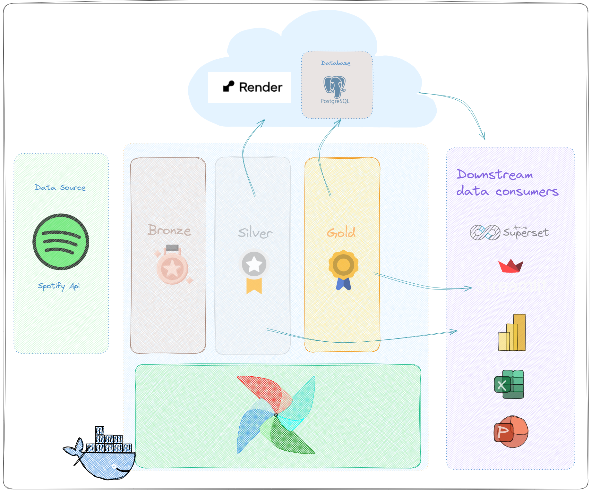
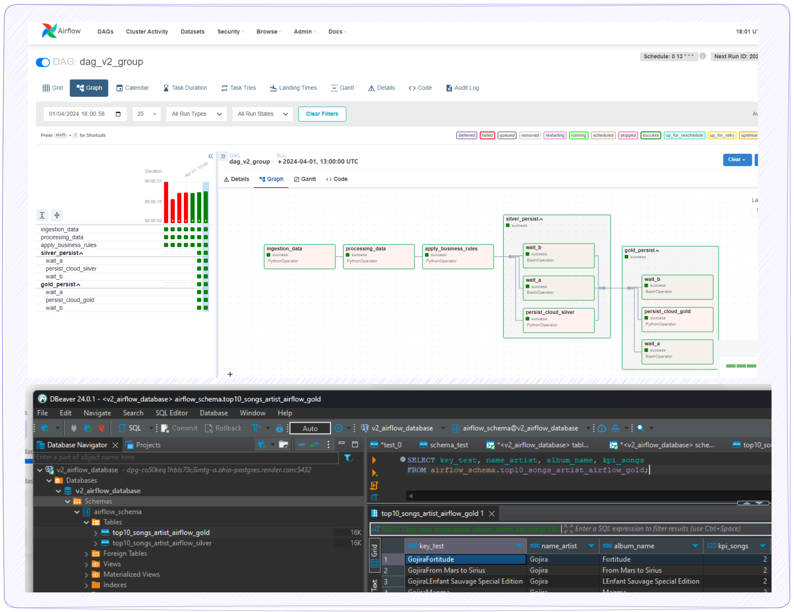

# v2

Ref:

#### [__Open workshop from Luciano Vasconcelos Filho__  ](https://www.youtube.com/watch?v=eXXImkz-vMs)
#### [__Local data airflow ref__  ](https://www.linkedin.com/pulse/como-fazer-tratamento-de-dados-com-airflow-docker-salvando-souza/)

## v1 + Persisting the data on a cloud (Render) database.

> 💻 Note: The downstream part will not be touched in this version. The illustration in the image was only to show that after this stage, the data will be ready for consumption.

> 💻 Note: Usually, Medallion arcs don't need to persist data in a database, the goal was exercise external conection with a cloud e.g. Render.

> ❗WARNING: Airflow isnt design to be a process data tool 🔧, but to orchestrat the diferent tools to process data and manage the process. But in this exemple and sometimes it can do it with small amounts of data.

> ❗WARNING: The term "simulation of Medallion architecture" is used because the data will be stored outside of a data lake (locally). I chose to begin with this step for the sake of a simpler and 💰 cost-free 💰 example.

> 🍀Tip: The choice of Render as a cloud was made for the sake of a simpler and 💰 cost-free 💰 example.

#### Building upon V1 as the base model (with almost identical files and structures), we only need to concern ourselves with minor changes.
(The focus here is to highlight the significant differences and the challenging aspects that require attention and effort to resolve.)

### Important points to be awere here:

(1) Same as in the previous version, to be careful about how you mount your data in docker-compose.file (check v1.)

(2) For the sake of fixing the content.

look for image: `${AIRFLOW_IMAGE_NAME:-{image name}:{image tag}}` in compose file

this time i changed v0 -> v1 `image: ${AIRFLOW_IMAGE_NAME:-extening_v2_airflow_image:1.0.0}`

this image name and image tag wil be used in the docker build command.
`docker build . --tag extening_v2_airflow_image:1.0.0`

### Other files:

Add the files and dev the code that were necessary to load the data into the cloud PostegresSQL database.
(here i did somechanges from my only docker-version of postegress modules.)

Silver zone -> Silver table
::: v2.src.load_db_cloud_job.save_db_postgress_silver

Golden zone -> Golden table
::: v2.src.load_db_cloud_job.save_db_postgress_golden

Have some changes in the dags files but wil touch it when it come to the topic.

Utilize the same instructions from v0 (with the necessary modifications) to start Airflow.

### *v2_dag:*

>💻 Note: The first thing to notice will be the groups, but I've only included them for the sake of the exercise; they have no utility or meaning, so you can just skip them.

>💻 Note: I've already displayed the tables in the cloud database for the sake of completion.

[Resume]
This DAG will do exactly the same thing as v1 and create two tables in the cloud database.

#### extract_task
::: v1.src.ingestion_job.extract_api

#### process_task 
::: v1.src.processing_job.transform_api

#### transform_task 
::: v1.src.businessrules_job.trasform_silver_data

#### task group Silver table
::: v2.src.load_db_cloud_job.save_db_postgress_silver

#### task group Golden table
::: v2.src.load_db_cloud_job.save_db_postgress_golden

💻 Note: In Airflow, you can usually use different operators that have specific usage. For example, you can use the PostgresOperator to make your life easier. However, sometimes when you need to change the database or use a different kind of solution, it's nice to know how to build it manually. Also, the solution for it was very near my Docker studies. I had to make some adaptations, but it was very helpful for the base. So, knowing the basics of how this process of extract, transform, and load works gives more freedom and insights through the solutions.

Here must be referenced Luciano Vasconcelos Filho for this insight of using your own built-in solutions to grasp the fundamentals of the process, which gives you a better view of how the tool works and prevents you from being stuck with new kinds of solutions.
